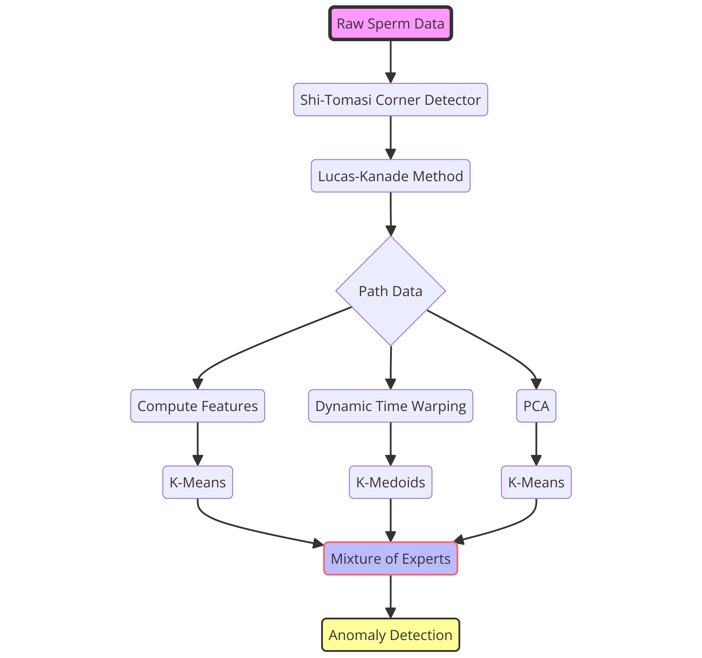
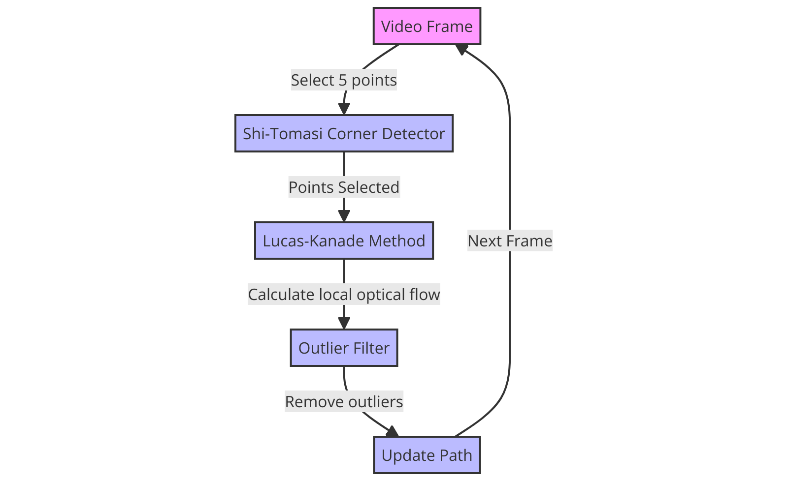

# Fertilisers

This repository is a group entry to "Fertility: In Vitro, In Silico, In Clinico" hackathon.

## SUMMARY: Automated Workflow to Aid in Sperm Selection from Video Data

# Overview

Our objective was to conduct a temporal analysis of sperm movement patterns observed throughout the duration of the videos. To achieve this we developed an algorithm to extract path data from a video dataset and calculated quantitative motility parameters such as the velocity, straight-line distance and curvilinear distance.

We then used the raw path data and calculated motility parameters to classify sperm motility patterns using unsupervised machine learning techniques. More specifically, we employed a mixture of experts approach to cluster the data and identify anomalies, which was later evaluated against a hand labelled test data set and shown to have an accuracy of over 90%. Our methodology is summarised in Figure 1.

<div>
<div style="display:flex">
  <div style="flex:50%; padding:10px; text-align:center;">
    
  </div>
</div>
<div style="text-align:center">Figure 1: Our anomaly detection methodology.</div>

# Path Extraction

## Motivation and Summary

The data provided for this challenge is pre-tracked videos from 2 sperm samples moving in vitro. To analyse the motion of the sperm we first need to extract the path the sperm takes from the videos. To do this we use the Lucas-Kanade method to estimate the background movement velocity at several "corner" points, take the average velocity after removing outliers, and use the average velocity to build up a path. We went on to validate this method qualitatively using overlaid path animations and quantitatively against hand tracked data, and saw high accuracy. The method is performant, running ~ 1 frame per 0.6ms, and so could easily be adapted to run with a live video stream in real time. 

## Algorithm and Implementation

<div>
<div style="display:flex">
  <div style="flex:50%; padding:10px; text-align:center;">
    
  </div>
</div>
<div style="text-align:center">Figure 2: The path extraction algorithm.</div>

\
To estimate the background velocity, we first have to choose good points in the image to track. This is achieved using the Shi-Tomasi corner detection alogorithm. Let $x,y$ decribe the coordinates of an abitrary pixel, $I(x,y)$ be the intensity of the pixel, and $w(x,y)$ be a weighting function. Corners are sharp maximisers of the following function:

```math
E(u, v)=\sum_{x, y} \underbrace{w(x, y)}_{\text {weighting function }}[\underbrace{I(x+u, y+v)}_{\text {shifted intensity }}-\underbrace{I(x, y)}_{\text {intensity }}]^2 \approx\left[\begin{array}{ll} u & v \end{array}\right] M\left[\begin{array}{l} u \\ v \end{array}\right]
```

where

```math
M=\sum_{x, y} w(x, y)\left[\begin{array}{ll} I_x I_x & I_x I_y \\ I_x I_y & I_y I_y \end{array}\right]
```

where $I_x$ and $I_y$ are the image derivatives, which can be seen by linearity and taylor expansion.
The quality of a corner can be identified by the size of the minimum eigenvalue of $M$, namely
$$R=\min(\lambda_1,\lambda_2).$$
We choose the $k$ highest ranked corners using this metric for tracking. We also mask out the center to avoid tracking the sperm head.

Once we have good features to track, we estimate the local optical flow using the Lucas-Kanade method.
This assumes that the flow is locally approximately constant which is valid for the moving background
in this dataset. A window of points which we label $\mathbf{x}_i=(x_i,y_i)$ for $i \in 0,...n$ is taken around the tracked pixel. Imposing the optical flow condition at each point gives an overdetermined stystem

```math
I_x(\mathbf{x}_i) v_x+I_y(\mathbf{x}_i) v_y = - I_t(\mathbf{x}_i)
```

where $I_x,I_y$ and $I_t$ are the image derivates with respect to $x,y$ and $t$ respectively. We can write this in matrix form as a least squares problem

```math
\mathbf{v}^*=\min_{\mathbf{v}}A\mathbf{v}-\mathbf{b}
```

where

```math
A=\left[\begin{array}{cc} I_x\left(\mathbf{x}_1\right) & I_y\left(\mathbf{x}_1\right) \\ I_x\left(\mathbf{x}_2\right) & I_y\left(\mathbf{x}_2\right) \\ \vdots & \vdots \\ I_x\left(\mathbf{x}_n\right) & I_y\left(\mathbf{x}_n\right) \end{array}\right] \quad v=\left[\begin{array}{c} v_x \\ v_y \end{array}\right] \quad b=\left[\begin{array}{c} -I_t\left(\mathbf{x}_1\right) \\ -I_t\left(\mathbf{x}_2\right) \\ \vdots \\ -I_t\left(\mathbf{x}_n\right) \end{array}\right].
```

Solving this problem gives the local optical flow. 
To avoid detecting other moving sperm, we remove outliers from the flow vectors. This is achieved using the mahalanobis distance, which is defined as
$$d_M(\mathbf{x},X)=\sqrt{(\mathbf{x}-\mathbf{\mu})S^{-1}(\mathbf{x}-\mathbf{\mu})}$$
where $X$ is a proability distribution with mean $\mu$ and covariance matrix $S$. In practice we estimate this using the sample mean and covariance matrix. Sample points with a mahalanobis distance greater than 2
are rejected.

Finally, the optical flow is estimated using the mean of the remaining flow vectors, and the position of the background is incremented and stored in a vector.

## Benchmarking

https://github.com/EleneLomi/Fertilisers/assets/79370760/a9a7a1d8-19c2-4a81-96b7-bd292e8c0c08

### Accuracy Against Hand Tracked Videos

<div>
<div style="display:flex">
  <div style="flex:50%; padding:10px;">
    
  </div>
  <div style="flex:50%; padding:10px;">
    
  </div>
</div>
<div style="text-align:center">Figure 3: Hand tracked paths vs lkof_framewise path extraction algorithm.</div>

# Feature Engineering

To identify clusters, we combine preprocessing steps, feature extraction and several clustering methods in a mixture of experts methodology. We discuss these preprocessing steps below.

## Feature Extraction

From the raw path data, several path features can be extracted. Following the work of <a href="https://ietresearch.onlinelibrary.wiley.com/doi/full/10.1049/ipr2.12178"> Alabdulla et al.</a> , we extracted the following path variables: curvilinear velocity, straight-line velocity, average line velocity, linear progressive motility, curvilinear path wobbling, average path straightness, average path crossing curvilinear path, and mean angular displacement.

In short, our goal is to extract metrics that can classify the motility level and type of the tracked cells.

## Recentering and Rotation

A desirable attribute of our classification model is its translational and rotational invariance. That is, if a cell starts moving from a different spot on the Cartesian plane or it moves at a different angle, we would still classify the cell as the same type. Hence, we directly incorporate this inductive bias into the learner we trained by re-centering every path so that it starts at the origin. Furthermore, we rotate every path so that the final point also lies on the x-axis.

## Recentering and PCA

Another approach is to center the beginning of the path on the origin and then take the x-axis to be the direction of the greatest change. In this case, we consider the path as a matrix of shape (T, 2) and align the x-axis with the vector corresponding to the eigenvector with the largest eigenvalue. We note that this approach again produces a path that is rotationally and translationally invariant. Furthermore, the path is also invariant to mirroring across any of the axes.

## Path Segmentation

Another improvement we have found is to segment the paths. We segment every path in multiple pieces, each of the length of 23 frames. We found this to provide better accuracy. In particular, later in classification each segment could be mapped to a different cluster and hence the resulting classificiation can be either temporally split or made more robust but taking the most common label from each segment. This is what we end up doing. This will be very important later.

# Mixture of Experts

Given the features we have extracted, our aim is to use unsupervised learning for clustering the paths. The objective is to then utilize the trained model for clustering unknown samples as well as performing anomaly detection. In this section, we present our learning architecture based on a mixture of experts, which provides a more robust unsupervised learning approach compared to using a single architecture.

# Dynamic Time Warping

Dynamic Time Warping (DTW) is a technique used to measure similarity between two temporal sequences. For instance, in time series analysis, DTW can compare two sequences that may not align perfectly in time but nevertheless exibith similar traits (like going in a straight line or wobbling). In this case we use DTW to compute the distances between extracted paths.

The algorithm works by finding the optimal allignemnt between two sequences. The pseudocode to calculate the distance between two time series A and B, both of length $n$ is:

```python
def dtw(A,B):
  D = zeros(n, n)
  for i in range(1, n+1):
      for j in range(1, n+1):
          cost = norm(A[i-1], B[j-1])
          D[i,j] = cost + min(D[i-1, j], D[i, j-1], D[i-1, j-1])
  return D[n, n]
```

where `norm` is simply the norm we prefer, in our case we consider the 2-norm. We found out that results are better if we take A and B to be either the X or the Y coordinates of a path. Hence the total distance between two paths is given by the sum of the DTW between the X coordinates and the Y coordinates. Note that this is consistent with the translation and rotation we perform at the beginning.

# K-Means and K-Medoids

We employ both the K-Means and K-Medoids unsupervised algorithms in our approach. The concept is straightforward: given data, we cluster it into $k$ different subgroups. Each group is characterized by a center, and each point is assigned to the center to which it is closest.

The K-Means algorithm begins by randomly setting the centers and then clustering all the data by assigning them to the nearest center based on some norm. Subsequently, it recalculates the centers so that the new center is precisely at the mean of all points within that group. Then, it re-clusters all the points based on these centers, and so forth. This process is repeated until convergence is achieved, i.e., when the recomputation of centers does not change the clustering of points.

The K-Medoids algorithm is utilized when the norm used for classifying points does not allow for a mean to be computed. This scenario arises with the DTW algorithm, where defining a time series that is exactly in between two time series is not possible. In such cases, the center is taken to be the element in the group that is closest to all other elements, serving as an approximation to the mean in the K-Means algorithm. The rest of the algorithm is similar.

## Mixture of Experts

Based on the above, we train three different unsupervised learning algorithms:

- K-Means on the vector of path features.
- K-Means on the x-axis of the data that is rotated using eigenvectors with the standard 2-norm.
- K-Medoids on the translated and rotated data using Dynamic Time Warping.

We then align the (arbitrary) labels of each method to minimize the elements which are labeled differently by the methods. The final centers are:

```
Center Index Congruent Label:  2
Mean Straight Line Velocity: 1.8504304990846459
Corresponding to Progrsessive cells path segments.

Center Index Congruent Label:  1
Mean Straight Line Velocity: 0.6805590579486639
Corresponding to Non-Progrsessive cells path segments.

Center Index Congruent Label:  0
Mean Straight Line Velocity: 1.8684070122829306
Corresponding to unknown cells path segments.

```

Given a new path, we can classify it by comparing it to the computed centers for each method. If the new path is longer than the used segment we segment it and compare it piecewise. This process is very fast, as we only need to compare the new path to the cluster centers as opposed to the whole database.

We leverage the mixture of experts by assigning a path to the label to which it is most frequently assigned using a majority rule. Hence, we could say that each method "votes" on the class membership of a new path. Since each method considers different features, this makes the classification more robust to perturbations, errors in path extraction, and other potential anomalies.

## Anomaly Detection

With the mixture of experts outlined above, implementing an anomaly detection algorithm for a new path is straightforward. A path is detected as 'anomalous' if it lies far from any of the cluster centers. Again, we employ a majority rule among the three experts, enhancing the robustness of our anomaly detection approach.

# Final Results

The provided database is limited by the fact that there are no immobile cells tracked. Therefore, we focus our attention on classifying progressive and non-progressive cells. In theory, the best approach would be to use only 2 classes: one for progressive and the other for non-progressive cells. We found that empirically, using 3 classes provides better results. Given the flaws of the tracking algorithm and the short segments, we found that the intermediary class is very helpful.

In practice, all cells in the test and train datasets, when we take the most common label over the different segments, get classified either in group 1 (corresponding to non-progressive) or in group 2 (corresponding to progressive). In practice, our algorithm learns independently of the labels, and hence is much more robust. The fact that we are able to classify the groups from just a few examples is very promising. Group 3 (intermediate segment) is never used to classify a cell.

Given that we interpret the groups this way, we achieve a 92.68% accuracy on the hand-labeled dataset. Below, we will review some of the mistakes and successes of our algorithm. We note that we did not use the hand-labelled data during the training of the models.

## Successes

Non-progressive cells:

<!-- [VIDEO sample3_vid7_sperm21_id345 AND sample1_vid5_sperm15_id70] -->

https://github.com/EleneLomi/Fertilisers/assets/79370760/e539b296-3dc4-47b7-a698-e1074b01401e

https://github.com/EleneLomi/Fertilisers/assets/79370760/e3733cb2-0c6f-4b21-8607-682dced22662

Progressive cells:

<!--[VIDEO sample3_vid1_sperm15_id409 AND sample3_vid5_sperm3_id256]-->

https://github.com/EleneLomi/Fertilisers/assets/79370760/1a580d7f-f48f-4862-a7a9-ad32b3100e10

https://github.com/EleneLomi/Fertilisers/assets/79370760/8d35b28d-4549-4b1b-8cff-c04ce1a84cc6

## Errors and Anomalies

These two cells were misclassified:

<!-- [VIDEO sample1_vid1_sperm3_id3, sample3_vid2_sperm13_id81] -->

https://github.com/EleneLomi/Fertilisers/assets/79370760/9e1c851d-5021-4b25-be9d-f5cf5853b2bc

https://github.com/EleneLomi/Fertilisers/assets/79370760/1adf1ed2-57ea-45da-a52c-f7b0459894ba

This cell got flagged as anomalous as it was lying far away from the centers of two out of three experts:

<!-- [VIDEO sample3_vid9_sperm16_id149] -->

https://github.com/EleneLomi/Fertilisers/assets/79370760/31e28795-c96b-4c95-82a3-80c9a68c829c

We believe this is because it is moving much faster and straighter than the others.

# Team

Our team is made up of Mitja Devetak, Elene Lominadze, Ben Nicholls-Mindlin and Peter Waldert.
