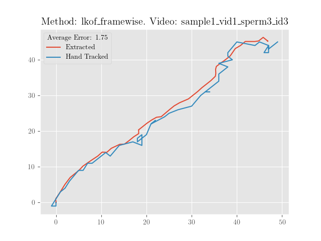
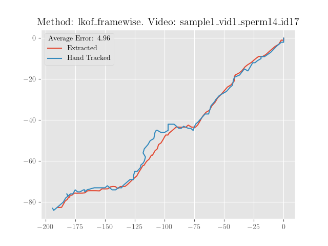

# Fertilisers
This repository is a group entry to "Fertility: In Vitro, In Silico, In Clinico" hackathon.


## <span style="color:blue">GOAL: We need to choose the project.</span>

## Table of Contents

- [Fertilisers](#fertilisers)
  - [GOAL: We need to choose the project.](#goal-we-need-to-choose-the-project)
  - [Table of Contents](#table-of-contents)
- [Introduction](#introduction)
- [Background](#background)
- [Path Extraction](#path-extraction)
  - [Motivation and Summary](#motivation-and-summary)
  - [Alogirithm and Implementation.](#alogirithm-and-implementation)
  - [Benchmarking](#benchmarking)
    - [Accuracy Against Hand Tracked Videos](#accuracy-against-hand-tracked-videos)
    - [Performance](#performance)
- [Path Analysis](#path-analysis)
- [Team](#team)

---
# Introduction

(Elene: Need to edit)
In the 1960s and 1970s, our understanding of the events in human oocyte fertilization grew to the point that in vitro fertilization (IVF) of human oocytes became possible. Ultimately, this knowledge led to the widely acclaimed first live birth of a “test tube baby,” Louise Brown, in England in 1978. Today, IVF accounts for millions of births worldwide and 1–3% of all births every year in the U.S. and Europe. The use of IVF has been on the rise recently, mostly as a result of deferred childbearing, and there is no reason to believe that this trend will alter. Infertility therapies have advanced significantly thanks to the methods and techniques that were established via studies on animals and, more recently, people. Some technical discoveries in reproductive medicine have had a significant impact on innovations and treatment choices in other fields of medicine as well. The focus of a great deal of research nowadays is to improve on the current ~30% success rate of IVF. Artificial intelligence and computational modelling have been gaining traction for their potential to improve outcomes for IVF. In this project, we try to use computational tools to improve fertility outcomes in the IVF clinic. Specifically, our objective is to ____.

# Background

# Path Extraction
## Motivation and Summary
The data provided for this challenge is pre-tracked videos from 2 sperm samples moving in vitro. To analyse the motion of the sperm we first need to extract the path the sperm takes from the videos. To do this we use the Lucas-Kanade method to estimate the background movement velocity at several "corner" points, take the average velocity after removing outliers, and use the average velocity to build up a path. We went on to validate this method qualitatively using overlaid path animations and quantiatively against hand tracked data, and saw high accuracy. The method is performant, running ~ 1 frame per 0.6ms, and so could easily be adapted to run with a live video stream in real time. Although the real world applicability of this path extraction method in the IVF setting may be slightly limited as it seems likely the system that initally tracked the sperm would record the path data as well, it is plausible that the path data may be lost in a data wipe or hard to accesss in propeitary software and a method such as this one would become necessary. 
## Alogirithm and Implementation.
To estimate the background velocity, we first have to choose good points in the image to track. This is achieved using the Shi-Tomasi corner detection alogorithm. Let $x,y$ decribe the coordinates of an abitrary pixel, $I(x,y)$ be the intensity of the pixel, and $w(x,y)$ be a weighting function. Corners are sharp maximisers of the following function: 
$$E(u, v)=\sum_{x, y} \underbrace{w(x, y)}_{\text {weighting function }}[\underbrace{I(x+u, y+v)}_{\text {shifted intensity }}-\underbrace{I(x, y)}_{\text {intensity }}]^2 \approx\left[\begin{array}{ll} u & v \end{array}\right] M\left[\begin{array}{l} u \\ v \end{array}\right]$$
where 
$$M=\sum_{x, y} w(x, y)\left[\begin{array}{ll} I_x I_x & I_x I_y \\ I_x I_y & I_y I_y \end{array}\right]$$
where $I_x$ and $I_y$ are the image derivatives, which can be seen by linearity and taylor expansion.
The quality of a corner can be identified by the size of the minimum eigenvalue of $M$, namely
$$R=\min(\lambda_1,\lambda_2).$$
We choose the $k$ highest ranked corners using this metric for tracking. In practice this is implemented using ```cv2.goodFeaturesToTrack``` with $k=5$, and mask out the center to avoid tracking the sperm head.


Once we have good features to track, we estimate the local optical flow using the Lucas-Kanade method. 
This assumes that the flow is locally approximately constant which is valid for the moving background
in this dataset. A window of points which we label $\mathbf{x}_i=(x_i,y_i)$ for $i \in 0,...n$ is taken around the tracked pixel. Imposing the optical flow condition at each point gives an overdetermined stystem
$$I_x(\mathbf{x}_i) v_x+I_y(\mathbf{x}_i) v_y = - I_t(\mathbf{x}_i)$$
where $I_x,I_y$ and $I_t$ are the image derivates with respect to $x,y$ and $t$ respectively. We can write this in matrix form as a least squares problem
$$\mathbf{v}^*=\min_{\mathbf{v}}A\mathbf{v}-\mathbf{b}$$
where 
$$A=\left[\begin{array}{cc} I_x\left(\mathbf{x}_1\right) & I_y\left(\mathbf{x}_1\right) \\ I_x\left(\mathbf{x}_2\right) & I_y\left(\mathbf{x}_2\right) \\ \vdots & \vdots \\ I_x\left(\mathbf{x}_n\right) & I_y\left(\mathbf{x}_n\right) \end{array}\right] \quad v=\left[\begin{array}{c} v_x \\ v_y \end{array}\right] \quad b=\left[\begin{array}{c} -I_t\left(\mathbf{x}_1\right) \\ -I_t\left(\mathbf{x}_2\right) \\ \vdots \\ -I_t\left(\mathbf{x}_n\right) \end{array}\right].$$
Solving this problem gives us the Lucas-Kanade estimate of the local optical flow. In practice this is implemented using ```cv2.calcOpticalFlowPyrLK```.
To avoid detecting other moving sperm, we remove outliers from the flow vectors. This is achieved using the mahalanobis distance, which is defined as 
$$d_M(\mathbf{x},X)=\sqrt{(\mathbf{x}-\mathbf{\mu})S^{-1}(\mathbf{x}-\mathbf{\mu})}$$
where $X$ is a proability distribution with mean $\mu$ and covariance matrix $S$. In practice we estimate this using the sample mean and covariance matrix. Sample points with a mahalanobis distance greater than 2
are rejected.

Finally, the optical flow is estimated using the mean of the remaining flow vectors, and the position of the background is incremented and stored in a vector.
The full implementation can be found in ```pymotility/path_extraction/extract_path.py::lkof_framewise_extract_path```.
## Benchmarking

https://github.com/EleneLomi/Fertilisers/assets/79370760/84bf0ab1-017f-44d1-8931-62ccfc0ceeb7


### Accuracy Against Hand Tracked Videos
<div>
<div style="display:flex">
  <div style="flex:50%; padding:10px;">
    
  </div>
  <div style="flex:50%; padding:10px;">
    
  </div>
</div>
<div style="text-align:center">Figure 1: Hand tracked paths vs lkof_framewise path extraction algorithm.</div>

### Performance
On average for this dataset, 
# Path Analysis

# Team
Our team is made up of Mitja Devetak, Elene Lominadze, Ben Nicholls-Mindlin and Peter Waldert. We all met studying Mathematical Modelling and Scientific Computing at the University of Oxford.
